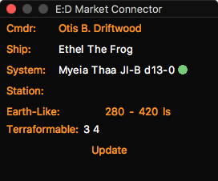

# Habitable Zone plugin for [EDMC](https://github.com/Marginal/EDMarketConnector/wiki)

This plugin displays the "habitable-zone" (i.e. the range of distances in which you might find an Earth-Like World) when you scan the primary star in a system with a [Detailed Surface Scanner](http://elite-dangerous.wikia.com/wiki/Detailed_Surface_Scanner).

Optionally, you can choose to display the ranges in which you might find Metal-Rich, Water and/or Ammonia Worlds.

## Installation

* On EDMC's Plugins settings tab press the “Open” button. This reveals the `plugins` folder where EDMC looks for plugins.
* Download the [latest release](https://github.com/Marginal/HabZone/releases/latest).
* Open the `.zip` archive that you downloaded and move the `HabZone` folder contained inside into the `plugins` folder.

You will need to re-start EDMC for it to notice the new plugin.

## Acknowledgements

Calculations taken from Jackie Silver's [Hab-Zone Calculator](https://forums.frontier.co.uk/showthread.php?p=5452081).

## License

Copyright © 2017 Jonathan Harris.

Licensed under the [GNU Public License (GPL)](http://www.gnu.org/licenses/gpl-2.0.html) version 2 or later.
